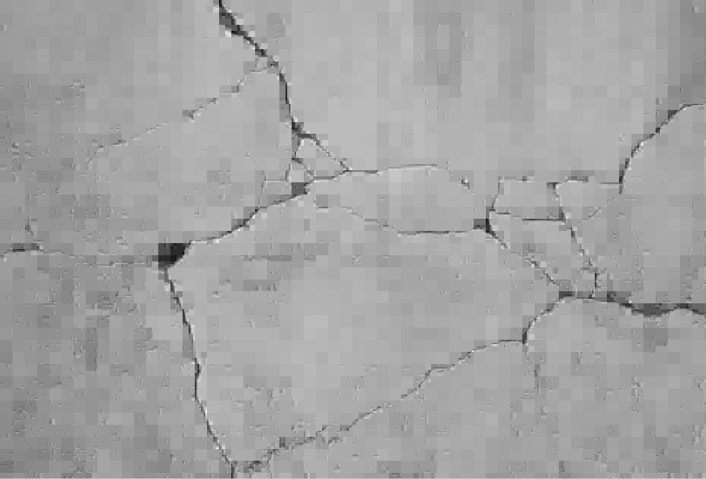

# wavelet-opencv
使用opencv，实现图像的小波分解、重构，小波降噪和模极大值边缘检测。

haar小波自动阈值降噪，分解层数为3
```cpp
my_wavelet::Wavelet wavelet;
cv::Mat srcGray = cv::imread("D:\\pictures\\crack.jpg", 0);
if (srcGray.empty()) {
	return -1;
}
std::vector<cv::Mat> decMats;
std::vector<cv::Size> decMatsWH;
wavelet.wavedec2d(srcGray, 3, my_wavelet::wdb1, decMats, decMatsWH);
wavelet.waveautoden(decMats);
cv::Mat recMat;
wavelet.waverec2d(my_wavelet::wdb1, decMats, decMatsWH,recMat);
```
# 原图
<div align=left></div>

# 降噪图
<div align=left></div>

小波模极大值边缘检测
```cpp
cv::Mat edge;
wavelet.waveedge(srcGray, 2, 0.03, edge);
tick.stop();
std::cout << "Time: " << tick.getTimeMilli() << std::endl;
cv::Mat blurImg;
cv::GaussianBlur(srcGray, blurImg, cv::Size(5, 5), 0, 0);
cv::Mat cannyEdge;
cv::Canny(blurImg, cannyEdge, 30, 60);
```
# 模极大值边缘检测
<div align=left></div>

# canny边缘检测
<div align=left></div>
